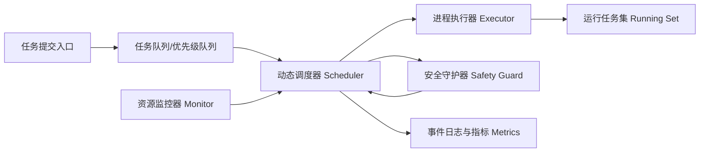

# 计算资源动态调度与防爆保护架构（主线文档）

更新时间：2026-02-09（UTC+08:00）

## 1. 项目目标
本项目面向本地电脑/本地服务器，解决以下问题：
1. 任务并发运行时 CPU/GPU/内存容易打满。
2. 任务提交无节制导致内存“爆炸”，系统卡死甚至重启。
3. 缺少统一调度，任务优先级混乱，关键任务被低价值任务抢占资源。

核心目标：
1. 实时监控资源（CPU、内存、GPU）。
2. 按资源状态动态调度任务进程（接纳、排队、限流、暂停/终止）。
3. 内存高水位触发保护，优先保证系统稳定。
4. 输出可审计日志，便于复盘和调优。

---

## 2. 系统总体架构

模块职责：
1. `Monitor`：周期采样 CPU/内存/GPU。
2. `Scheduler`：基于实时资源状态决定启动/阻断/重排任务。
3. `Safety Guard`：在高水位或紧急状态下执行保护动作（降并发、拒绝新任务、终止低优先级任务）。
4. `Executor`：只负责执行被调度器放行的任务。
5. `Metrics`：记录每次决策和状态变化，用于评估稳定性。

---

## 3. 资源状态分级

定义三档状态：
1. `NORMAL`：资源健康，可按最大并发执行。
2. `HIGH`：接近上限，降低并发并限制低优先级任务。
3. `EMERGENCY`：接近失稳，停止新任务并触发主动回收。

为避免模式抖动，采用两种稳态机制：
1. 资源平滑：对 CPU/内存等指标做指数滑动平均（EMA）。
2. 滞回与冷却：从 `EMERGENCY` 回落时保留若干冷却 tick，防止瞬时波动导致误放行。

建议阈值（可配置）：
1. `memory_high_pct = 85`
2. `memory_emergency_pct = 92`
3. `cpu_high_pct = 80`
4. `cpu_hard_pct = 95`
5. `gpu_memory_high_pct = 85`
6. `gpu_memory_emergency_pct = 95`

---

## 4. 调度策略

### 4.1 任务模型
每个任务至少包含：
1. `priority`（数值越小优先级越高）
2. `estimated_mem_mb`
3. `estimated_cpu_pct`
4. `estimated_gpu_mem_mb`
5. `preemptible`（是否允许被抢占终止）

### 4.2 接纳策略（Admission Control）
任务在启动前必须过三道检查：
1. 预测内存占用是否超过紧急阈值。
2. 预测 CPU 负载是否超过硬上限。
3. 若启用 GPU 保护，预测显存占用是否超过阈值。

若任一检查失败：
1. 阻断启动；
2. 保留在队列中等待；
3. 记录阻断原因。

为避免“同一 tick 启动过多任务”导致预测失真，接纳时采用累计预算：
1. 每放行一个任务，立即把其估算资源计入本 tick 的预测负载；
2. 后续任务在“已计划负载”基础上继续判断。

### 4.3 动态并发策略
1. `NORMAL`：并发 = `max_workers`
2. `HIGH`：并发 = `max(max_workers//2, min_workers)`
3. `EMERGENCY`：并发 = 0（只允许回收，不允许新启动）

### 4.4 防爆回收策略
当进入 `EMERGENCY`：
1. 先终止低优先级且 `preemptible=true` 的任务；
2. 每轮回收固定数量任务（可配置）；
3. 恢复到 `HIGH` 或 `NORMAL` 后再逐步恢复接纳。

---

## 5. 防止“内存爆炸/重启”的实现逻辑

本项目采用“提前阻断 + 紧急回收 + 资源预留”三层保护：
1. **提前阻断**：启动前做预测，不让任务把内存推到危险区。
2. **紧急回收**：已到危险区时，主动终止低优先级任务，快速止血。
3. **资源预留**：保留 `reserve_memory_mb` 给系统和关键进程，避免 OS 被挤爆。

说明：
1. 软件层面可以显著降低风险；
2. 但无法承诺 100% 不重启（例如驱动异常、硬件故障、外部进程抢占）。

---

## 6. 数据与日志

每个调度周期输出：
1. 资源快照（CPU/内存/GPU）
2. 当前模式（NORMAL/HIGH/EMERGENCY）
3. 启动任务列表
4. 阻断任务列表及原因
5. 回收任务列表及原因
6. 运行中任务数、排队任务数

关键指标：
1. `admission_blocked_total`
2. `preempted_total`
3. `emergency_ticks`
4. `completed_total`
5. `scheduler_tick_ms`

---

## 7. 关键流程（Tick）
每次调度循环做 6 件事：
1. 采样资源。
2. 刷新运行任务状态（回收已完成任务）。
3. 判定当前资源模式。
4. 如为紧急模式，触发抢占回收。
5. 按目标并发尝试接纳队列任务。
6. 记录事件与指标。

---

## 8. 工程实现落点（对应当前仓库）
1. 核心实现：`prototype/resource_scheduler.py`
2. 演示入口：`prototype/main.py`
3. 压测/实验：`prototype/run_experiments.py`
4. 单元测试：`prototype/tests/test_resource_scheduler.py`
5. 配置样例：`spec/scheduler_config.example.json`
6. 配置校验：`qa/validate_scheduler_config.py`

---

## 9. 迭代计划

Phase 1（已实现目标）：
1. 基础调度器
2. 资源状态分级
3. 防爆回收
4. 单元测试与实验指标输出

Phase 2（下一阶段）：
1. 更精细的任务资源预测（动态学习任务画像）
2. 任务暂停/恢复（不仅是终止）
3. 多队列策略（实时任务、批处理任务分离）
4. 可视化看板与告警通知
