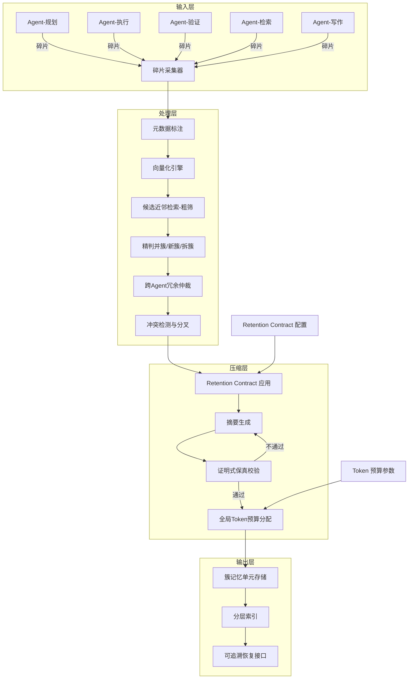

# 详细技术开发方案：偏好约束的跨智能体语义记忆碎片聚类压缩系统

> 版本：v1.0 | 作者：Claude (Opus 4.6) | 日期：2026-02-09
> 状态：初稿，待 Codex 实现与用户确认

---

## 1. 系统概述

### 1.1 问题定义

在单机多智能体协作场景中（规划 Agent、执行 Agent、验证 Agent、检索 Agent、写作 Agent 等），各智能体持续产出对话片段、工具调用输出与中间推理结论。这些信息若无节制堆入共享上下文，将导致：

- **上下文膨胀**：token 数快速逼近模型窗口上限，推理成本线性增长
- **信息碎片化**：同一事实被多个 Agent 重复/变体表达，关键早期信息被淹没
- **冲突隐匿**：不同 Agent 对同一问题给出矛盾结论，若简单截断或摘要则冲突信息丢失
- **偏好失控**：不同任务场景对"保留什么、压缩什么"有不同需求，缺乏结构化约束机制

### 1.2 系统目标

设计并实现一个**偏好约束的跨智能体语义记忆碎片聚类压缩系统**，核心能力：

1. 将多智能体产出的信息碎片按语义聚类，消除跨 Agent 冗余
2. 通过结构化偏好契约（Retention Contract）控制压缩行为
3. 对压缩结果进行证明式保真校验，防止关键信息丢失或幻觉引入
4. 在全局 token 预算下最优分配各簇摘要长度
5. 保留冲突信息的分叉结构，而非强行融合

### 1.3 技术方案四大核心创新点

| # | 创新点 | 对应专利差异化切口 | 区别于现有技术 |
|---|--------|-------------------|---------------|
| 1 | Retention Contract（偏好保留契约） | 切口 A | 从"软提示"升级为"硬约束+可审计校验" |
| 2 | 跨 Agent 冗余仲裁与信用分配 | 切口 B | 锚定跨 Agent 冗余最小化与可解释仲裁 |
| 3 | 全局 token 预算优化分配 | 切口 C | 显式优化问题，非逐簇独立摘要 |
| 4 | 证明式保真校验与自动修订 | 切口 A 延伸 | 蕴含/矛盾检测驱动的迭代修订机制 |

---

## 2. 系统架构

### 2.1 总体架构图（Mermaid）



### 2.2 模块职责一览

| 模块 | 输入 | 输出 | 核心职责 |
|------|------|------|---------|
| 碎片采集器 | 各 Agent 原始输出 | Fragment 对象列表 | 统一格式化，分配唯一 ID |
| 元数据标注 | Fragment | 带元数据的 Fragment | 标注来源 Agent、时间戳、主题候选、置信度、工具输出指纹 |
| 向量化引擎 | Fragment.text | Fragment.embedding | 文本转向量（支持可插拔 embedding 模型） |
| 候选近邻检索 | Fragment.embedding | 候选簇 ID 列表 | ANN/LSH 粗筛，返回 top-k 候选 |
| 精判并簇 | Fragment + 候选簇 | 簇分配决策 | 综合语义相似、主题一致、来源置信、冲突风险做最终判定 |
| 跨 Agent 冗余仲裁 | 簇内 Fragment 集合 | 共识陈述 + 证据列表 + 信用分配记录 | 消除冗余，生成加权共识 |
| 冲突检测与分叉 | 簇内 Fragment 集合 | 分叉摘要结构 | NLI/矛盾检测，输出共识+争议+仲裁建议 |
| Retention Contract 应用 | 簇 + RC 配置 | 槽位约束参数 | 解析契约，确定各槽位最低覆盖要求 |
| 摘要生成 | 簇内容 + 槽位约束 + 长度预算 | 候选摘要 | LLM 驱动的受约束摘要生成 |
| 证明式保真校验 | 候选摘要 + 原始碎片 | PASS/FAIL + 失败原因 | 蕴含检测 + 矛盾检测 + 槽位覆盖验证 |
| 全局 Token 预算分配 | 所有簇的效用函数 + 总预算 B | 各簇长度分配 {l_i} | 求解约束优化问题 |
| 分层索引 | 簇记忆单元 | 索引结构 | 支持按簇/按主题/按时间/按 Agent 检索与展开 |

---

## 3. 核心数据结构

### 3.1 记忆碎片（Fragment）

```python
@dataclass(frozen=True)
class Fragment:
    """不可变的记忆碎片，多智能体产出的信息最小单元"""
    id: str                    # 全局唯一 ID (UUID v4)
    text: str                  # 原始文本内容
    source_agent: str          # 来源智能体标识
    timestamp: datetime        # 产出时间
    topic_candidates: list[str]  # 主题标签候选列表
    confidence: float          # 来源 Agent 对该内容的置信度 [0.0, 1.0]
    tool_fingerprint: str | None  # 工具调用/输出的哈希指纹（如有）
    ref_count: int = 0         # 被后续步骤引用的计数
    external_hash: str | None = None  # 原始输入在外部存储的 hash/ID
    embedding: list[float] | None = None  # 向量化后的嵌入表示
```

### 3.2 语义簇（Cluster）

```python
@dataclass
class Cluster:
    """语义簇：碎片按语义相近聚合的容器"""
    id: str                    # 簇唯一 ID
    fragments: list[Fragment]  # 簇内碎片集合
    centroid: list[float]      # 簇质心向量
    topic: str                 # 主导主题标签
    created_at: datetime       # 簇创建时间
    updated_at: datetime       # 最近更新时间
    conflict_flag: bool = False  # 是否存在内部冲突
```

### 3.3 簇记忆单元（ClusterMemoryUnit）

```python
@dataclass
class ClusterMemoryUnit:
    """压缩后的簇输出单元，包含完整审计信息"""
    cluster_id: str
    consensus: str             # 共识摘要文本
    disagreements: list[Disagreement]  # 争议分叉列表
    evidence_pointers: list[str]  # 证据碎片 ID 列表
    credit_assignment: dict[str, float]  # {agent_id: 信用权重}
    slot_coverage: dict[str, bool]  # {槽位名: 是否覆盖}
    compression_report: CompressionReport  # 压缩审计报告
    allocated_tokens: int      # 分配的 token 预算
    actual_tokens: int         # 实际使用的 token 数

@dataclass
class Disagreement:
    """争议分叉结构"""
    point: str                 # 争议点描述
    position_a: str            # 立场 A
    position_b: str            # 立场 B
    evidence_a: list[str]      # 支持 A 的碎片 ID
    evidence_b: list[str]      # 支持 B 的碎片 ID
    arbitration_suggestion: str  # 仲裁建议

@dataclass
class CompressionReport:
    """可审计的压缩报告"""
    slot_coverage_list: dict[str, list[str]]  # {槽位: 覆盖的碎片ID列表}
    evidence_pointer_ids: list[str]
    conflict_forks: list[str]  # 冲突分叉 ID 列表
    revision_history: list[RevisionRecord]  # 修订记录

@dataclass
class RevisionRecord:
    """保真校验失败后的修订记录"""
    attempt: int               # 第几次尝试
    failure_reason: str        # 失败原因
    action_taken: str          # 采取的修订动作
```
### 3.4 偏好保留契约（Retention Contract）

```python
@dataclass
class RetentionContract:
    """结构化、可执行、可校验的偏好保留契约"""
    name: str                  # 契约名称（如 "patent_writing"）
    slots: list[SlotSpec]      # 槽位规格列表
    topic_whitelist: list[str] # 主题白名单（优先保留）
    topic_blacklist: list[str] # 主题黑名单（可强压缩）
    source_weights: dict[str, float]  # {agent_id: 保留权重}
    max_compression_ratio: float  # 最大压缩比（安全阈值）

@dataclass
class SlotSpec:
    """单个槽位的规格定义"""
    name: str                  # 槽位名称
    # 可选值: facts / procedure-steps / rationale / decisions /
    #         parameter-ranges / tool-results / risks / TODOs / citations
    min_coverage: int          # 最低保留条数
    required_fields: list[str] # 每条必须包含的字段
    # 例如 procedure-steps 要求: ["action", "object", "condition_or_param"]
    priority: int              # 优先级 (1=最高)
```

**JSON Schema 示例（专利写作场景）：**

```json
{
  "name": "patent_writing",
  "slots": [
    {"name": "procedure-steps", "min_coverage": 5, "required_fields": ["action", "object", "condition_or_param"], "priority": 1},
    {"name": "parameter-ranges", "min_coverage": 3, "required_fields": ["param_name", "range", "unit"], "priority": 1},
    {"name": "rationale", "min_coverage": 2, "required_fields": ["decision", "reason"], "priority": 2},
    {"name": "tool-results", "min_coverage": 2, "required_fields": ["tool", "output_summary"], "priority": 2},
    {"name": "risks", "min_coverage": 1, "required_fields": ["risk_description"], "priority": 3},
    {"name": "citations", "min_coverage": 3, "required_fields": ["source", "claim"], "priority": 2}
  ],
  "topic_whitelist": ["technical_solution", "claim_feature", "experiment_result"],
  "topic_blacklist": ["casual_chat", "greeting"],
  "source_weights": {"planner": 1.0, "executor": 0.9, "verifier": 1.0, "retriever": 0.8, "writer": 0.7},
  "max_compression_ratio": 0.15
}
```

---

## 4. 九步流程详细算法设计

### 步骤 1：碎片采集与元数据标注

**输入**：各 Agent 的原始文本输出
**输出**：`list[Fragment]`

```
FUNCTION collect_and_annotate(raw_outputs: list[AgentOutput]) -> list[Fragment]:
    fragments = []
    FOR each output IN raw_outputs:
        frag = Fragment(
            id = generate_uuid(),
            text = output.text,
            source_agent = output.agent_id,
            timestamp = output.timestamp,
            topic_candidates = extract_topics(output.text),  # 轻量级主题分类器
            confidence = output.agent_confidence OR default_confidence(output.agent_id),
            tool_fingerprint = hash(output.tool_call) IF output.tool_call ELSE None,
            external_hash = hash(output.raw_input)
        )
        fragments.append(frag)
    RETURN fragments
```

**关键设计决策**：
- `extract_topics()` 使用轻量级分类器（如 few-shot prompt 或小型分类模型），不依赖重型 NLP pipeline
- `confidence` 可由 Agent 自报，也可根据 Agent 历史验真率动态计算
- Fragment 创建后不可变（frozen dataclass），保证审计可追溯

### 步骤 2：向量化与候选近邻检索（粗筛）

**输入**：`list[Fragment]`
**输出**：每个 Fragment 的候选簇 ID 列表

```
FUNCTION vectorize_and_coarse_search(fragments: list[Fragment], index: ANNIndex) -> dict[str, list[str]]:
    candidates = {}
    FOR each frag IN fragments:
        frag.embedding = embedding_model.encode(frag.text)

        IF index.is_empty():
            # 首个碎片，创建新簇
            candidates[frag.id] = []
        ELSE:
            # ANN 检索 top-k 候选
            top_k = index.search(frag.embedding, k=K_CANDIDATES)  # K_CANDIDATES=10
            candidates[frag.id] = [hit.cluster_id FOR hit IN top_k IF hit.distance < COARSE_THRESHOLD]

        index.add(frag.embedding, metadata=frag.id)

    RETURN candidates
```

**技术选型建议**：
- Embedding 模型：`text-embedding-3-small` 或开源 `bge-base-zh-v1.5`（中文场景）
- ANN 索引：`FAISS` (IVF-PQ) 或 `hnswlib`，支持增量插入
- `COARSE_THRESHOLD`：余弦距离 < 0.3（可配置）

### 步骤 3：精判并簇/新簇/拆簇

**输入**：Fragment + 候选簇列表
**输出**：簇分配决策（JOIN / NEW / SPLIT）

```
FUNCTION fine_grained_assignment(frag: Fragment, candidate_clusters: list[Cluster]) -> Decision:
    IF len(candidate_clusters) == 0:
        RETURN Decision.NEW_CLUSTER(frag)

    scores = []
    FOR each cluster IN candidate_clusters:
        sem_sim = cosine_similarity(frag.embedding, cluster.centroid)
        topic_match = jaccard(frag.topic_candidates, [cluster.topic])
        source_diversity = 1.0 IF frag.source_agent NOT IN cluster.source_agents ELSE 0.5
        conflict_risk = estimate_conflict_risk(frag, cluster)  # NLI 快速检测

        score = (W_SEM * sem_sim
               + W_TOPIC * topic_match
               + W_DIVERSITY * source_diversity
               - W_CONFLICT * conflict_risk)
        scores.append((cluster, score))

    best_cluster, best_score = max(scores, key=lambda x: x[1])

    IF best_score >= JOIN_THRESHOLD:
        # 检查是否需要拆簇
        IF best_cluster.size > MAX_CLUSTER_SIZE AND intra_cluster_variance(best_cluster) > SPLIT_THRESHOLD:
            RETURN Decision.SPLIT_AND_JOIN(best_cluster, frag)
        RETURN Decision.JOIN(best_cluster, frag)
    ELSE:
        RETURN Decision.NEW_CLUSTER(frag)
```

**权重参数（可配置）**：
- `W_SEM=0.4, W_TOPIC=0.25, W_DIVERSITY=0.15, W_CONFLICT=0.2`
- `JOIN_THRESHOLD=0.55, MAX_CLUSTER_SIZE=50, SPLIT_THRESHOLD=0.8`
### 步骤 4：跨智能体冗余仲裁

**输入**：簇内所有 Fragment
**输出**：共识陈述 + 证据列表 + 信用分配记录

```
FUNCTION cross_agent_arbitration(cluster: Cluster) -> ArbitrationResult:
    # 1. 按来源 Agent 分组
    agent_groups = group_by(cluster.fragments, key=lambda f: f.source_agent)

    # 2. 识别冗余：同一事实被多个 Agent 表述
    fact_groups = semantic_dedup(cluster.fragments, similarity_threshold=0.85)

    # 3. 对每组冗余事实做信用加权
    consensus_statements = []
    credit_records = {}

    FOR each fact_group IN fact_groups:
        # 计算每条碎片的信用分
        FOR each frag IN fact_group:
            credit = (
                frag.confidence                           # Agent 自报置信度
                * source_weight(frag.source_agent)        # 来源权重（来自 RC）
                * (1 + 0.1 * frag.ref_count)             # 被引用加成
                * tool_bonus(frag.tool_fingerprint)       # 有工具输出则加成 1.2x
            )
            credit_records[frag.id] = credit

        # 选择信用最高者作为共识基础
        best_frag = max(fact_group, key=lambda f: credit_records[f.id])
        consensus_statements.append(ConsensusStatement(
            text = best_frag.text,
            primary_source = best_frag.id,
            supporting_evidence = [f.id FOR f IN fact_group IF f.id != best_frag.id],
            credit_score = credit_records[best_frag.id]
        ))

    RETURN ArbitrationResult(
        consensus = consensus_statements,
        credit_assignment = credit_records,
        redundancy_ratio = 1 - len(consensus_statements) / len(cluster.fragments)
    )
```

**关键设计**：
- `semantic_dedup()` 使用 embedding 余弦相似度 > 0.85 判定为同一事实的不同表述
- `tool_bonus()` 对有工具输出佐证的碎片给予 1.2x 加成，因为工具输出通常比纯推理更可靠
- 信用分配记录完整保留，支持事后审计"为什么选了这条而非那条"

### 步骤 5：冲突检测与分叉保留

**输入**：簇内 Fragment 集合（经过步骤 4 仲裁后）
**输出**：分叉摘要结构（共识 + 争议 + 仲裁建议）

```
FUNCTION detect_conflicts_and_fork(cluster: Cluster, consensus: list[ConsensusStatement]) -> ConflictResult:
    conflicts = []

    # 1. 对簇内所有碎片对做矛盾检测
    FOR i, frag_a IN enumerate(cluster.fragments):
        FOR frag_b IN cluster.fragments[i+1:]:
            nli_result = nli_classifier(premise=frag_a.text, hypothesis=frag_b.text)

            IF nli_result.label == "CONTRADICTION" AND nli_result.score > NLI_THRESHOLD:
                conflicts.append(ConflictPair(
                    frag_a_id = frag_a.id,
                    frag_b_id = frag_b.id,
                    contradiction_score = nli_result.score,
                    topic = infer_conflict_topic(frag_a, frag_b)
                ))

    # 2. 对检测到的冲突生成分叉结构
    disagreements = []
    FOR each conflict IN conflicts:
        frag_a = get_fragment(conflict.frag_a_id)
        frag_b = get_fragment(conflict.frag_b_id)

        disagreements.append(Disagreement(
            point = conflict.topic,
            position_a = frag_a.text,
            position_b = frag_b.text,
            evidence_a = find_supporting(frag_a, cluster),
            evidence_b = find_supporting(frag_b, cluster),
            arbitration_suggestion = generate_arbitration_hint(frag_a, frag_b)
        ))

    # 3. 从共识中移除有冲突的部分
    clean_consensus = [s FOR s IN consensus IF s.primary_source NOT IN conflict_fragment_ids]

    RETURN ConflictResult(
        consensus = clean_consensus,
        disagreements = disagreements,
        has_conflicts = len(disagreements) > 0
    )
```

**技术选型**：
- NLI 模型：`cross-encoder/nli-deberta-v3-base` 或中文场景用 `IDEA-CCNL/Erlangshen-Roberta-330M-NLI`
- `NLI_THRESHOLD = 0.75`（可配置）
- `generate_arbitration_hint()` 使用 LLM 生成简短仲裁建议（如"建议由验证 Agent 重新执行确认"）

### 步骤 6：应用 Retention Contract

**输入**：簇 + Retention Contract 配置
**输出**：槽位约束参数，指导摘要生成

```
FUNCTION apply_retention_contract(cluster: Cluster, rc: RetentionContract) -> SlotConstraints:
    constraints = {}

    FOR each slot IN rc.slots:
        # 从簇内碎片中提取匹配该槽位的内容
        matching_frags = []
        FOR each frag IN cluster.fragments:
            IF slot_classifier(frag.text, slot.name) > SLOT_MATCH_THRESHOLD:
                matching_frags.append(frag)

        # 检查是否满足最低覆盖
        constraints[slot.name] = SlotConstraint(
            required_count = slot.min_coverage,
            available_count = len(matching_frags),
            matching_fragments = matching_frags,
            required_fields = slot.required_fields,
            priority = slot.priority,
            is_satisfiable = len(matching_frags) >= slot.min_coverage
        )

    # 应用主题白名单/黑名单
    FOR each frag IN cluster.fragments:
        IF any(topic IN rc.topic_blacklist FOR topic IN frag.topic_candidates):
            frag.compression_priority = "aggressive"  # 可强压缩
        ELIF any(topic IN rc.topic_whitelist FOR topic IN frag.topic_candidates):
            frag.compression_priority = "conservative"  # 优先保留

    RETURN SlotConstraints(
        slot_specs = constraints,
        source_weights = rc.source_weights,
        max_compression_ratio = rc.max_compression_ratio
    )
```

### 步骤 7：证明式保真校验与自动修订

**输入**：候选摘要 + 原始碎片 + 槽位约束
**输出**：PASS/FAIL + 修订后摘要（如需要）

```
FUNCTION verify_and_revise(summary: str, cluster: Cluster, constraints: SlotConstraints,
                           max_retries: int = 3) -> VerificationResult:
    revision_history = []

    FOR attempt IN range(1, max_retries + 1):
        failures = []

        # 检查 1：槽位覆盖验证
        FOR slot_name, constraint IN constraints.slot_specs.items():
            IF constraint.priority <= 2:  # 只强制检查高优先级槽位
                covered = check_slot_coverage(summary, slot_name, constraint.required_fields)
                IF covered < constraint.required_count:
                    failures.append(f"槽位 {slot_name}: 需要 {constraint.required_count} 条，实际覆盖 {covered} 条")

        # 检查 2：关键信息蕴含检测
        key_sentences = extract_key_sentences(cluster, top_k=5)
        FOR sent IN key_sentences:
            entailment = nli_classifier(premise=summary, hypothesis=sent)
            IF entailment.label != "ENTAILMENT" OR entailment.score < 0.7:
                failures.append(f"关键句未被蕴含: '{sent[:50]}...'")

        # 检查 3：无证据新信息检测（幻觉检测）
        summary_claims = extract_claims(summary)
        FOR claim IN summary_claims:
            has_evidence = any(
                nli_classifier(premise=frag.text, hypothesis=claim).label == "ENTAILMENT"
                FOR frag IN cluster.fragments
            )
            IF NOT has_evidence:
                failures.append(f"无证据新信息（疑似幻觉）: '{claim[:50]}...'")

        IF len(failures) == 0:
            RETURN VerificationResult(status="PASS", summary=summary, revision_history=revision_history)

        # 记录失败并触发修订
        revision_history.append(RevisionRecord(
            attempt = attempt,
            failure_reason = "; ".join(failures),
            action_taken = "trigger_revision" IF attempt < max_retries ELSE "fallback_to_conservative"
        ))

        IF attempt < max_retries:
            summary = revise_summary(summary, failures, cluster)  # LLM 修订
        ELSE:
            # 降级为保守摘要：直接引用关键碎片原文
            summary = generate_conservative_summary(cluster, constraints)

    RETURN VerificationResult(status="PASS_WITH_FALLBACK", summary=summary, revision_history=revision_history)
```
### 步骤 8：全局 Token 预算分配

**输入**：所有簇的效用函数参数 + 总预算 B
**输出**：各簇的摘要长度分配 `{cluster_id: allocated_tokens}`

```
FUNCTION allocate_token_budget(clusters: list[Cluster], total_budget: int,
                                rc: RetentionContract) -> dict[str, int]:
    # 1. 为每个簇计算效用函数参数
    utilities = {}
    FOR each cluster IN clusters:
        U_i = compute_utility_params(cluster, rc)
        # U_i 包含: preference_weight, importance, recency, conflict_risk, ref_frequency
        utilities[cluster.id] = U_i

    # 2. 定义效用函数 U_i(l_i)
    #    U_i(l_i) = w_pref * pref_i * log(1 + l_i)
    #             + w_imp * importance_i * log(1 + l_i)
    #             + w_rec * recency_i * l_i
    #             + w_conf * conflict_risk_i * l_i  (冲突簇需要更多空间)
    #             - w_ref * (1 / (1 + ref_freq_i)) * l_i  (高引用簇边际效用递减慢)

    # 3. 求解约束优化问题
    #    max  Σ U_i(l_i)
    #    s.t. Σ l_i <= B
    #         l_i >= MIN_TOKENS_PER_CLUSTER  (每簇最低保障)
    #         l_i <= MAX_TOKENS_PER_CLUSTER  (防止单簇垄断)

    # 使用拉格朗日乘子法或贪心近似
    allocation = {}

    # 先分配最低保障
    remaining = total_budget
    FOR each cluster IN clusters:
        min_tokens = max(MIN_TOKENS_PER_CLUSTER, estimate_min_for_slots(cluster, rc))
        allocation[cluster.id] = min_tokens
        remaining -= min_tokens

    IF remaining < 0:
        # 预算不足以满足所有最低保障，按优先级裁剪
        allocation = priority_based_trim(allocation, clusters, total_budget, rc)
        RETURN allocation

    # 贪心分配剩余预算：每轮给边际效用最高的簇加 STEP_SIZE tokens
    WHILE remaining >= STEP_SIZE:
        best_cluster = argmax(
            marginal_utility(cluster_id, allocation[cluster_id] + STEP_SIZE, utilities)
            FOR cluster_id IN allocation
            IF allocation[cluster_id] + STEP_SIZE <= MAX_TOKENS_PER_CLUSTER
        )
        allocation[best_cluster] += STEP_SIZE
        remaining -= STEP_SIZE

    RETURN allocation
```

**参数配置**：
- `MIN_TOKENS_PER_CLUSTER = 50`
- `MAX_TOKENS_PER_CLUSTER = 500`
- `STEP_SIZE = 10`
- 权重 `w_pref=0.3, w_imp=0.25, w_rec=0.2, w_conf=0.15, w_ref=0.1`

### 步骤 9：分层索引与可追溯恢复

**输入**：所有 ClusterMemoryUnit
**输出**：分层索引结构，支持多维度检索与按需展开

```
FUNCTION build_layered_index(units: list[ClusterMemoryUnit]) -> LayeredIndex:
    index = LayeredIndex()

    FOR each unit IN units:
        # 层级 1：簇级摘要索引（最压缩）
        index.add_summary_entry(
            cluster_id = unit.cluster_id,
            summary_text = unit.consensus,
            summary_embedding = embed(unit.consensus),
            topic = unit.topic,
            timestamp_range = (unit.earliest_timestamp, unit.latest_timestamp)
        )

        # 层级 2：证据指针索引（中间层）
        FOR each evidence_id IN unit.evidence_pointers:
            index.add_evidence_link(unit.cluster_id, evidence_id)

        # 层级 3：原始碎片索引（最详细，按需加载）
        FOR each frag_id IN unit.all_fragment_ids:
            index.add_fragment_ref(unit.cluster_id, frag_id)

    # 构建多维度检索入口
    index.build_topic_index()      # 按主题检索
    index.build_temporal_index()   # 按时间范围检索
    index.build_agent_index()      # 按来源 Agent 检索

    RETURN index

FUNCTION expand_on_demand(index: LayeredIndex, cluster_id: str, depth: int) -> str:
    """按需展开：从摘要逐层展开到原始碎片"""
    IF depth == 1:
        RETURN index.get_summary(cluster_id)
    ELIF depth == 2:
        summary = index.get_summary(cluster_id)
        evidence = index.get_evidence_texts(cluster_id)
        RETURN format_with_evidence(summary, evidence)
    ELIF depth == 3:
        RETURN index.get_all_fragments_text(cluster_id)
```

---

## 5. 技术选型建议

| 组件 | 推荐方案 | 备选方案 | 选型理由 |
|------|---------|---------|---------|
| Embedding 模型 | `text-embedding-3-small` (OpenAI) | `bge-base-zh-v1.5` (开源) | 前者精度高，后者可离线运行 |
| ANN 索引 | `FAISS` (IVF-PQ) | `hnswlib` | FAISS 生态成熟，支持 GPU 加速 |
| NLI 模型 | `cross-encoder/nli-deberta-v3-base` | `Erlangshen-Roberta-330M-NLI` | 前者英文精度高，后者中文适配好 |
| 摘要生成 | GPT-4o / Claude Sonnet | Qwen-2.5-72B | 闭源模型质量更高，开源模型可控性更强 |
| 主题分类 | Few-shot prompt (LLM) | 微调 BERT 分类器 | 初期用 prompt 快速迭代，后期可微调 |
| 数据存储 | SQLite + JSON 文件 | PostgreSQL + pgvector | 单机场景 SQLite 足够，扩展时迁移 |
| 向量存储 | FAISS 本地索引 | ChromaDB / Milvus | 单机场景 FAISS 性能最优 |

---

## 6. 实验设计

### 6.1 数据集

| 数据集 | 来源 | 用途 | 规模 |
|--------|------|------|------|
| 合成多 Agent 对话 | 自行构造 | 主实验 | 5 个场景 x 200 轮对话 |
| ShareGPT 长对话子集 | 公开数据 | 压缩率基准 | 1000 条长对话 |
| 人工标注冲突集 | 自行标注 | 冲突检测评估 | 100 组矛盾对 |

### 6.2 指标定义

| 指标 | 计算方式 | 目标值 |
|------|---------|--------|
| Token 压缩率 | `1 - (压缩后 tokens / 压缩前 tokens)` | >= 70% |
| 召回有效性 | `命中正确簇的查询数 / 总查询数` | >= 85% |
| 偏好合规率 | `满足槽位最低覆盖的簇数 / 总簇数` | >= 90% |
| 冲突保留率 | `正确分叉保留的冲突数 / 总冲突数` | >= 95% |
| 保真通过率 | `首次校验通过的簇数 / 总簇数` | >= 70% |
| 增量插入延迟 | `单条碎片从采集到入簇的耗时` | < 200ms |
| 全量压缩延迟 | `1000 条碎片全量压缩耗时` | < 30s |

### 6.3 对比基线

| 基线 | 描述 |
|------|------|
| Baseline-Truncate | 简单截断，保留最近 N tokens |
| Baseline-Summary | 逐轮对话摘要，无聚类 |
| Baseline-Cluster-Summary | 聚类 + 逐簇独立摘要，无偏好约束 |
| Ours-NoRC | 本方案去掉 Retention Contract |
| Ours-NoBudget | 本方案去掉全局预算分配 |
| Ours-Full | 本方案完整版 |

---

## 7. 开发路线图

### Phase 1：基础框架（对应 Master Prompt Step 3-4）

- [ ] 实现 Fragment / Cluster / ClusterMemoryUnit 数据结构
- [ ] 实现碎片采集器与元数据标注模块
- [ ] 实现向量化引擎（可插拔 embedding 接口）
- [ ] 实现 FAISS 索引的增量插入与 ANN 检索
- [ ] 实现精判并簇逻辑（JOIN/NEW/SPLIT）
- [ ] 单元测试覆盖以上模块

### Phase 2：核心创新模块（对应 Master Prompt Step 4）

- [ ] 实现跨 Agent 冗余仲裁（信用分配）
- [ ] 实现 NLI 冲突检测与分叉保留
- [ ] 实现 Retention Contract 解析与应用
- [ ] 实现摘要生成（LLM 驱动，受约束）
- [ ] 实现证明式保真校验与自动修订循环
- [ ] 实现全局 token 预算分配优化器
- [ ] 单元测试 + 集成测试

### Phase 3：实验与评估（对应 Master Prompt Step 5）

- [ ] 构造合成多 Agent 对话数据集
- [ ] 实现所有对比基线
- [ ] 运行实验，生成指标数据（CSV）
- [ ] 生成实验结果图表（PNG/SVG）
- [ ] 撰写实验分析报告

### Phase 4：专利文本（对应 Master Prompt Step 6-7）

- [ ] 权利要求书（方法独权 + 从权 + 系统独权 + 从权 + 存储介质）
- [ ] 说明书（技术领域 → 背景技术 → 发明内容 → 附图说明 → 具体实施方式）
- [ ] 摘要 + 附图说明 + 附图标记表
- [ ] 技术交底书
- [ ] QA 自检（支持性/清楚性/一致性/实施例充分性）

---

## 8. 文件产出清单

| 文件 | 目录 | 状态 |
|------|------|:----:|
| `architecture.md`（本文件） | `spec/` | 已完成 |
| `data_model.md` | `spec/` | 待产出 |
| `retention_contract.schema.json` | `spec/` | 待产出 |
| `algorithm_pseudocode.md` | `spec/` | 待产出（本文件已含伪代码，可提取） |
| `main.py` | `prototype/` | 待产出 |
| `tests/` | `prototype/` | 待产出 |
| `run_experiments.py` | `prototype/` | 待产出 |
| `prior_art_index.md` | `prior_art/` | 待产出 |
| `claim_chart.md` | `prior_art/` | 待产出 |
| 专利文本 6 份 | `patent/` | 待产出 |

---

*本方案由 Claude (Opus 4.6) 基于 Master Prompt D1/D2 技术主线撰写。*
*所有伪代码为设计规格，具体实现由 Codex 负责编码。*
*参数值为建议初始值，需通过实验调优确定最终值。*
